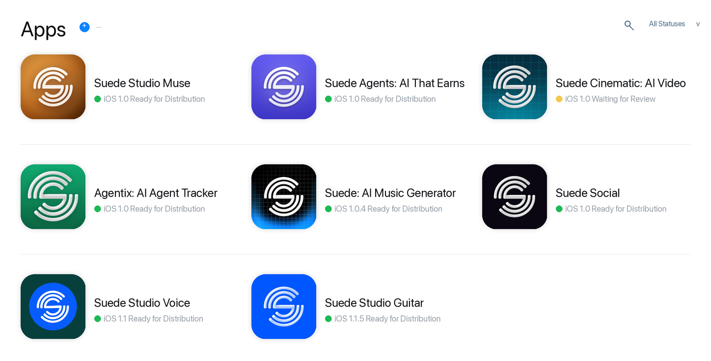

# Turn Any Website Into an iOS App

<p align="center">
  
  
  
  
  
  
</p>

> **By [Jason Colapietro](https://suedeai.ai/founder) / [Suede Labs AI](https://suedeai.ai)** — creator ownership infrastructure for the AI media era.

Free public skills and slash commands from Jason Colapietro and Suede for taking
any website, web app, dashboard, marketplace, PWA, or content surface and
turning it into an App Store-ready iOS app with AI coding agents.

This is the public-safe layer of the app factory stack Jason and Suede have
relied on to move fast across real iOS products: site-to-app conversion, native
SwiftUI scaffolding, App Store Optimization, screenshot production, release
gates, App Store Connect upload prep, and repeatable quality checks.

Bring a URL. The skills help an agent audit the site, choose the right native or
Capacitor path, add iOS-specific value, generate screenshots and store metadata,
and run the release gate before anything goes to App Review.

These are not toy prompts. This is the free public version of the workflow
behind Suede's app-store push and Jason's repeatable iOS shipping system.

It intentionally does **not** include secrets, signing material, private API
keys, private repo paths, Apple account identifiers, or App Store Connect
credentials. Bring your own Apple Developer account and environment variables.

<p align="center">
  
  
</p>

<p align="center">
  <sub>Stock photos from Unsplash: Daniel Korpai and Balazs Ketyi. Used under the Unsplash License.</sub>
</p>

## Start Here

Star it. Fork it. Clone it. Point it at your site. Turn the site into an app.

```bash
git clone https://github.com/JasonColapietro/ios-app-dev-skills.git
```

Then ask your agent:

```text
/ios-site-app https://your-site.com as an App Store-ready iOS app
```

The fast path:

```text
/ios-audit-site https://your-site.com
/ios-wrapper-risk https://your-site.com
/ios-capacitor-wrap https://your-site.com
/ios-store-assets https://your-site.com
/ios-submit-check ./YourApp
```

If you have a website, you have the start of an app. This repo is the free
Suede/Jason toolbelt for turning that surface into a real iPhone product.

Need the short version for GitHub search? This is an AI agent skill pack for
website to iOS app conversion, App Store-ready web-to-app workflows, SwiftUI app
development, Capacitor iOS shells, App Store Optimization, iOS screenshots, App
Review prep, and App Store Connect release gates.

## Website To App Workflow

Use this pack when you want to turn a site into a real iOS app instead of a thin
bookmark wrapper:

- audit any URL for mobile, PWA, auth, payments, privacy, support, and App Store
  wrapper risk;
- choose Capacitor remote shell, bundled shell, native SwiftUI shell, or full
  native rebuild;
- add native value: onboarding, settings, support, privacy, account deletion,
  share, push, deep links, offline, errors, and iOS navigation;
- configure bundle ID, icons, launch screen, entitlements, associated domains,
  screenshots, metadata, and review notes;
- run the ship gate so the app is truthful, buildable, screenshot-ready, and
  safe to submit when explicitly delegated.

The headline use case is simple: point Claude or Codex at a website and use
these free skills to turn it into an App Store-quality app path.

## SEO Tags

Primary search intent:

- turn website into iOS app
- website to app
- web to iOS app
- App Store-ready iOS app
- AI app development skills

GitHub topics and repo tags:

```text
site-to-ios, website-to-app, ios-app-development, mobile-app-development,
app-store-optimization, app-review, app-development, capacitor, swiftui,
fastlane, pwa, ai-agents, claude-code, codex, aso, screenshots, app-store,
app-store-connect, skills, ios
```

## Suede And Jason Proof



This public-safe pack documents the reusable layer of a proprietary iOS App
Factory method used across multiple submitted and approved apps by Jason
Colapietro and Suede. See [App Store submissions and approved apps](docs/app-store-submissions.md)
for the current public catalog snapshot, and
[the public-safe proprietary method](docs/proprietary-ios-method.md) for the
skill combination.

Suede uses this operating pattern to convert product surfaces, agent tools,
creator workflows, AI music utilities, and web-first ideas into mobile releases
without re-learning screenshots, ASO, signing, metadata, and App Review gates
every time. This repo gives the community the free reusable layer.

## What You Get For Free

### Skills

- `ios-app-factory` - one-prompt iOS app pipeline from keyword to ship gate.
- `ios-swiftui-product` - native SwiftUI product architecture and QA.
- `ios-screenshot-taker` - deterministic simulator capture for named app states.
- `ios-aso-launch` - App Store keyword, metadata, screenshots, and launch ops.
- `ios-app-store-release` - archive, upload, TestFlight, and review submission.
- `ios-capacitor-shell` - Capacitor shell inspection, sync, and release logic.
- `site-to-ios-app` - turn any site into an App Store-quality iOS app path.

### Slash Commands

Claude Code slash commands live in `.claude/commands/`:

Core app factory:

- `/ios-ship-app`
- `/ios-keyword`
- `/ios-new-app`
- `/ios-shot`
- `/ios-screens`
- `/ios-grade`
- `/ios-release`
- `/ios-capacitor`
- `/ios-site-app`

Website-to-app tools:

- `/ios-audit-site`
- `/ios-wrapper-risk`
- `/ios-capacitor-wrap`
- `/ios-native-shell`
- `/ios-pwa-check`
- `/ios-deeplinks`
- `/ios-offline`
- `/ios-auth-check`
- `/ios-payments-check`

Store and release tools:

- `/ios-icon`
- `/ios-privacy`
- `/ios-store-assets`
- `/ios-review-notes`
- `/ios-submit-check`

### Templates And Scripts

- `templates/fastlane/` - sanitized Fastlane App Store Connect templates.
- `templates/xcodegen/` - minimal XcodeGen project scaffold.
- `templates/app-store-metadata/` - deliver-compatible metadata files.
- `templates/release/` - export options and reviewer notes template.
- `templates/site-to-ios/` - reusable conversion plan.
- `scripts/ios_preflight.sh` - local Xcode/Fastlane/env preflight.
- `scripts/take_ios_screenshots.sh` - simulator build/install/launch screenshot capture.
- `scripts/audit_site_for_ios.py` - static site-to-iOS readiness audit.
- `scripts/validate_app_store_metadata.py` - App Store char-limit checks.
- `scripts/validate_skill_pack.py` - skill/slash-command sanity checks.
- `scripts/install.sh` - copy skills and commands into local agent folders.

## Install For Codex

```bash
git clone https://github.com/JasonColapietro/ios-app-dev-skills.git
cd ios-app-dev-skills

mkdir -p "${CODEX_HOME:-$HOME/.codex}/skills"
cp -R skills/* "${CODEX_HOME:-$HOME/.codex}/skills/"
```

Example prompts:

```text
Use $site-to-ios-app to turn https://example.com into an App Store-ready iOS app path.
```

```text
Use $ios-app-store-release to preflight this Xcode project for App Store upload.
```

```text
Use $ios-screenshot-taker to capture home, detail, and paywall screenshots on iPhone 15 Pro Max.
```

```text
Use $ios-app-factory to turn "AI agent rating" into a keyword-first iOS app plan.
```

## Install For Claude Code

Project-level install:

```bash
git clone https://github.com/JasonColapietro/ios-app-dev-skills.git
cd your-ios-project

mkdir -p .claude/skills .claude/commands
cp -R ../ios-app-dev-skills/skills/* .claude/skills/
cp -R ../ios-app-dev-skills/.claude/commands/* .claude/commands/
```

Then use:

```text
/ios-ship-app ai habit tracker for guitar practice
```

```text
/ios-site-app https://example.com as an App Store-ready iOS app
```

## Public Safety

- Do not commit `.p8`, `.xcconfig` secrets, `.env`, certificates, provisioning
  profiles, API keys, or App Store Connect tokens.
- Do not publish private App Store Connect app IDs, reviewer phone numbers, or
  private support credentials in generated reports.
- Do not submit to App Review unless the user explicitly delegates that release
  action and confirms the exact app, bundle ID, version, build, and account.
- Keep release templates generic. Use environment variables for credentials.

## Workflow

```text
idea / seed keyword
  -> website audit or keyword and competitor scan
  -> site-to-iOS conversion, native SwiftUI scaffold, or Capacitor shell
  -> monetization and legal truth
  -> deterministic screenshot capture
  -> screenshots and ASO metadata
  -> scorecard gate
  -> archive, upload, TestFlight, submit
  -> launch measurement loop
```

The default ship gate is:

- build succeeds,
- App Store metadata passes limits and keyword rules,
- screenshots exist and are conversion-oriented,
- no secrets are committed,
- no metadata claims unbuilt features,
- explicit human confirmation before public submission.

## Validate

```bash
python3 scripts/validate_skill_pack.py .
python3 scripts/validate_app_store_metadata.py templates/app-store-metadata
bash -n scripts/take_ios_screenshots.sh
bash scripts/ios_preflight.sh
python3 scripts/audit_site_for_ios.py https://example.com
```

## License

MIT.
