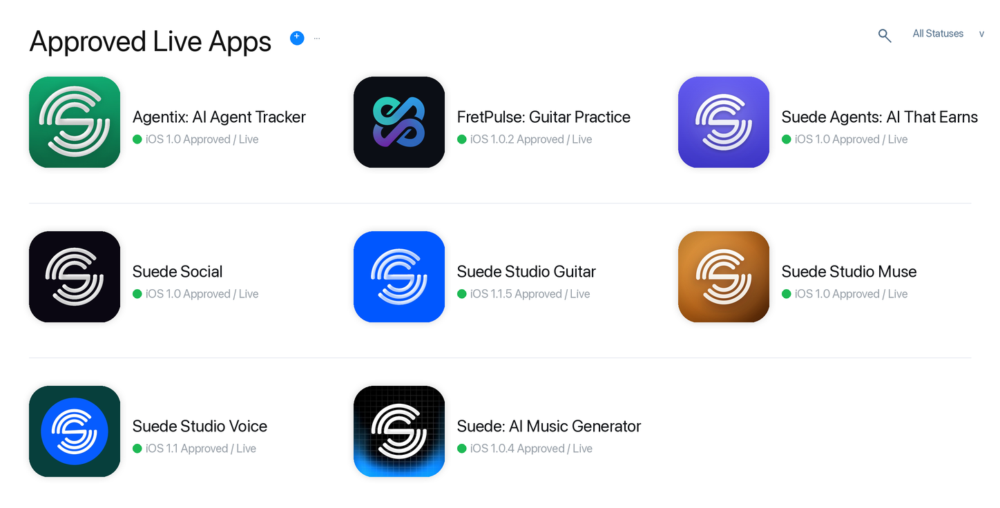

# App Store Submissions And Approved Apps

Verified on 2026-06-17 at 23:01 EDT with read-only sources:

- App Store Connect app catalog for submitted/current app records in the active
  account.
- The provided App Store Connect catalog screenshot for submitted-board status
  labels.
- Apple public lookup for approved apps that are live in the US App Store.

No App Store Connect secrets, private keys, certificates, provisioning profiles,
or tokens are included in this repository.

## Submitted App Catalog

These records were returned by the active App Store Connect app catalog.

| App | Bundle ID | Apple ID | Public lookup status |
| --- | --- | --- | --- |
| Agentix: AI Agent Tracker | `ai.suede.factory.agentix` | `6778286160` | Approved/live |
| Suede Agents: AI That Earns | `ai.suede.factory.agents` | `6778880737` | Approved/live |
| Suede Cinematic: AI Video | `xyz.suedeai.cinematic` | `6780266335` | App Store Connect record present; not public in Apple lookup at verification time |
| Suede Social | `ai.suede.social` | `6770668793` | Approved/live |
| Suede Studio Guitar | `ai.suede.fretpulse` | `6767552764` | Approved/live |
| Suede Studio Muse | `ai.suede.muse` | `6779134962` | Approved/live |
| Suede Studio Voice | `ai.suedeai.SuedeVoice` | `6767763231` | Approved/live |
| Suede: AI Music Generator | `xyz.suedeai.app` | `6765461286` | Approved/live |

## Approved And Live In Apple Public Lookup

These apps were returned by Apple public lookup and are the public approved/live
set used in the approved/live board.

| App | Bundle ID | Version | Seller | App Store |
| --- | --- | --- | --- | --- |
| Agentix: AI Agent Tracker | `ai.suede.factory.agentix` | `1.0` | jason colapietro | [Open](https://apps.apple.com/us/app/agentix-ai-agent-tracker/id6778286160?uo=4) |
| FretPulse: Guitar Practice | `io.fretpulse.app` | `1.0.2` | FretPulse LLC | [Open](https://apps.apple.com/us/app/fretpulse-guitar-practice/id6766649729?uo=4) |
| Suede Agents: AI That Earns | `ai.suede.factory.agents` | `1.0` | jason colapietro | [Open](https://apps.apple.com/us/app/suede-agents-ai-that-earns/id6778880737?uo=4) |
| Suede Social | `ai.suede.social` | `1.0` | jason colapietro | [Open](https://apps.apple.com/us/app/suede-social/id6770668793?uo=4) |
| Suede Studio Guitar | `ai.suede.fretpulse` | `1.1.5` | jason colapietro | [Open](https://apps.apple.com/us/app/suede-studio-guitar/id6767552764?uo=4) |
| Suede Studio Muse | `ai.suede.muse` | `1.0` | jason colapietro | [Open](https://apps.apple.com/us/app/suede-studio-muse/id6779134962?uo=4) |
| Suede Studio Voice | `ai.suedeai.SuedeVoice` | `1.1` | jason colapietro | [Open](https://apps.apple.com/us/app/suede-studio-voice/id6767763231?uo=4) |
| Suede: AI Music Generator | `xyz.suedeai.app` | `1.0.4` | jason colapietro | [Open](https://apps.apple.com/us/app/suede-ai-music-generator/id6765461286?uo=4) |

## Catalog Difference

FretPulse is approved/live in Apple public lookup under seller `FretPulse LLC`,
but it was not returned by the active App Store Connect account catalog used for
the submitted-record check. Suede Cinematic was returned by App Store Connect,
but it was not public in Apple lookup at verification time.

## Asset Provenance

The boards are sanitized generated images, not raw screenshots of private App
Store Connect pages. They use public Apple artwork where available and local
app-icon files only for App Store Connect-only records that were not public in
Apple lookup at verification time.
